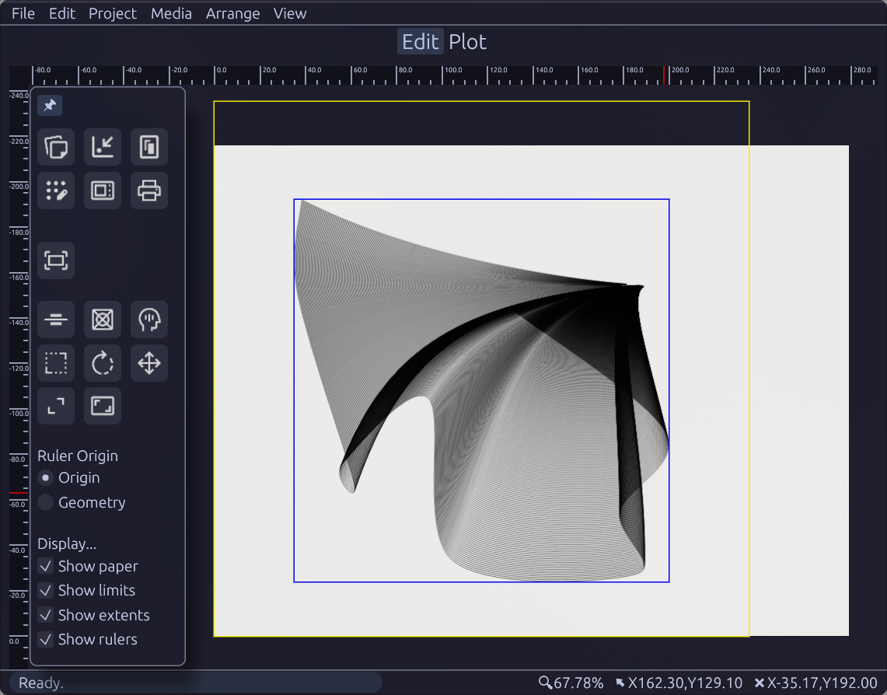
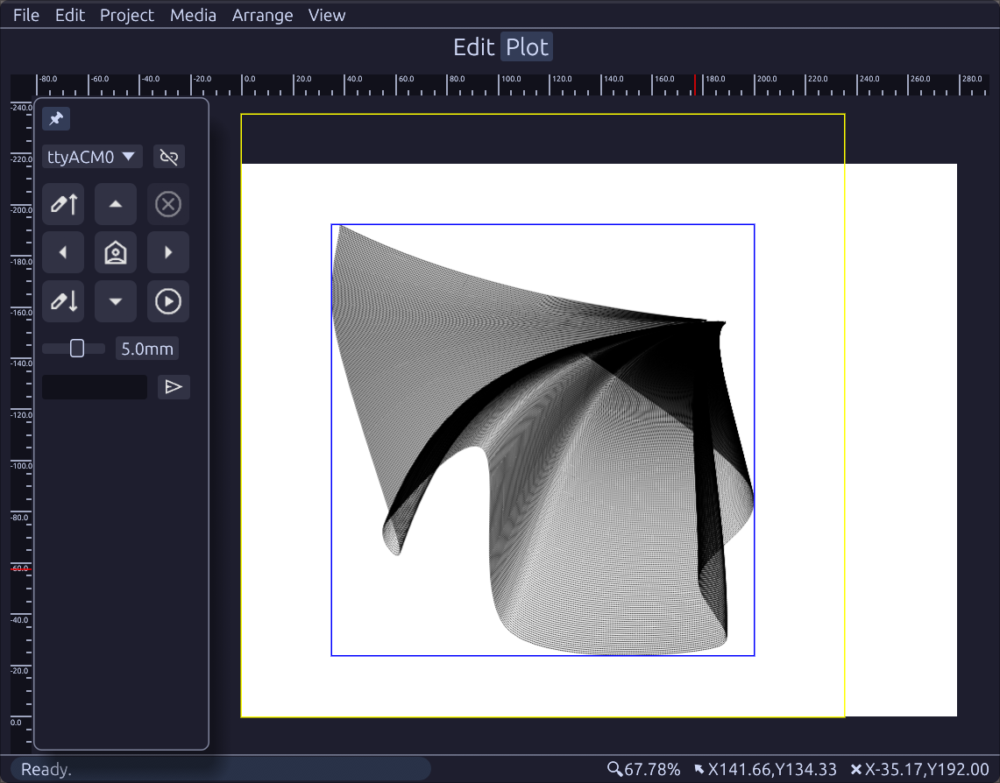
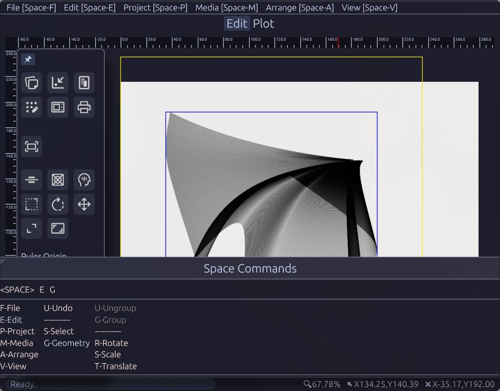
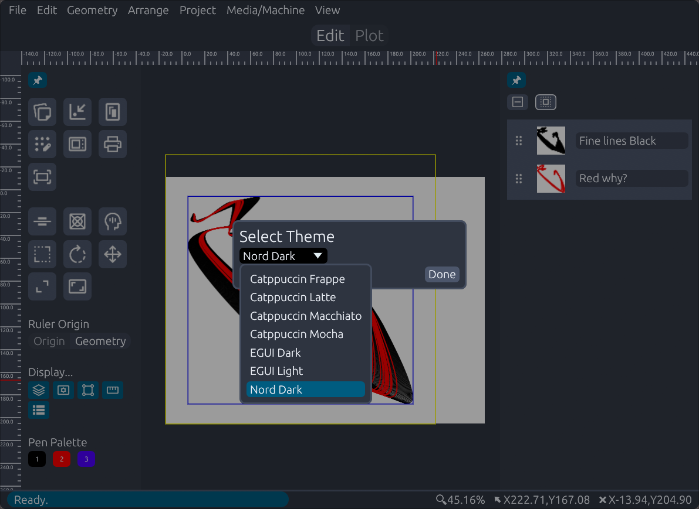

# Bot-a-Plot 
## This time in EGUI

No AI was used anywhere in the creation of this software. This is
artisanal free-range developer built software. It takes care of 
the plumbing so that YOU (a human, honest) can make art.

See also: [SMBC: Sad](https://www.smbc-comics.com/comic/sad-2).

Bot-a-Plot is a GCode generator/sender and post-processor that
turns SVG/PGF files into toolpaths for pen-plotting. It supports
GRBL dialects of GCode, and allows you to customize your post
processor depending on how your machine is configured. Virtual
and real toolchanges are supported for multiple pens.

Current release is 0.4.x, which will eventually become 1.0 after
a bit more testing.

## Current features:

 * Import SVG and PGF files,
 * Post process geometry to tool-paths
 * Machine post editor
 * Selection/modification of existing geometry
    * Rotation
    * Translation
    * Scaling
    * Pen selection
    * Select inside existing geometry
 * Undo stack
 * Matting to paper/machine limits, and smart matting to optimize
   use of space
    * Now with a nice interface!
 * Spacemacs inspired command palette for quick triggering of
   menu commands
 * Basic machine control (shuttle/pen up/down/etc.)
 * Themeing to match your fancy WM customizations.
 * Reordering geometry.

